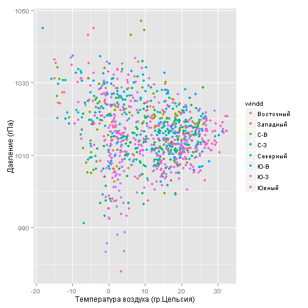
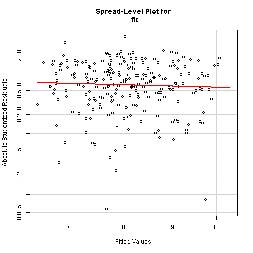

## Многофакторная линейная регрессионная модель зависимости продаж мороженного от погоды

author: *Grigory Miholap*
date: *15/11/2015*


## Содержание
1. Аннотация
2. Подготовка данных
3. Разведочный анализ
4. Построение модели
4.1. ТОП лето
4.2 ТОП весна
5. Выводы

## 1. Аннотация 
Напомню **вопросы**, которые поставлены перед исследованием:   
* Какова степень влияния погодных условий (температура, облачность, влажность, 
давление, осадки и т.п.)?  
* Как повышение средней температуры месяца на 1 градус влияет на изменение продаж?  
* Что важнее: температура воздуха или ясная погода?  
* Как влияют на продажи другие метеорологические показатели - влажность воздуха, 
атмосферное давление, скорость и направление ветра?  

В отчете исследована зависимость продаж мороженного (т.н. "импульсного" в упаковках до 200гр.) 
от метеорологических факторов - температуры, влажности, давления, скорости ветра.
В целом можно сказать, что погода значительно влияет на продажи, при этом летом
это влияние не так заметно, гораздо заметнее связь в межсезонье, зимой связь 
совсем слабая.(см. таблицу ниже) Также хочется отметить, что основным фактором с 
подавляющим перевесом является температура воздуха, остальные факторы влияют гораздо 
менее значимо, например летом дополнительное влияние оказывают влажность и давление,
а весной или осенью - скорость ветра и облачность. Однако, усложнение модели
с введением этих факторов не оправдано по причине их низкой значимости.


Таблица с параметрами моделей по сезонам.

Бренд | Сезон | Adj R-squared | Основной предиктор | Дополнительные предикторы
------------- | ------------- | ------------- | ------------- | ------------- 
ТОП | Лето  | 0.43  | tem | humifity, ppp 
ТОП | Весна  | 0.66  | tem | winds, clowdly 
ТОП | Осень  | 0.64  | tem | winds, clowdly
ТОП | Зима  | 0.13  | tem |  -

## 2. Подготовка данных
Подключаем нужные библиотеки

```r
library("dplyr")
library("ggplot2")
library("lattice")
library("xtable")
library("car")
```

Загрузка обработанных данных

```r
retail <- dget(file = "./retailtidy")
weather <- dget(file = "./weathertidy")
```

Объединение данных о продажах и погоде

```r
retweat <- merge(x=retail, y=weather, by = "date", all.x = T, all.y = F)
```

Выборка данных для бренда ТОП

```r
retweattop <- retweat[retweat$BRAND=="ТОП",]
```
в дальнейшем работаем с датасетом `retweattop`

## 3. Разведочный анализ
предварительный анализ показал, что характер зависимости продаж от погоды 
значительно различается для различных времен года. смотрите для примера характер
зависимости продаж от температуры воздуха (обратите внимание на различие шкал).
Поэтому было принято решение строить отдельные модели для различных времен 
года для каждого из брендов (Топ, Юкки и Soletto)

```r
xyplot(saleskg~tem|season, data = retweattop, layout = c(1, 4), scales 
            = "free", breaks = 50)
```

 


Далее, посмотрим, как взаимосвязаны различные параметры в датасете.

3.1. Диаграмма рассеивания Влажность ~ Температура, цветом обозначены уровни облачности  

```r
ggplot(data = retweat, aes(x = tem, y=humidity, col=clowdlyf)) + geom_point()+
  xlab("Температура воздуха (гр.Цельсия)")+ylab("Влажность (%)")
```

 

3.2. Боксплот Температура ~ Направление ветра    

```r
ggplot(data = retweat, aes(x = windd, y=tem)) + geom_boxplot()+
  xlab("Направление ветра")+ylab("Температура (гр.Цельсия)")
```

 

3.3. Диаграмма рассеивания Давление ~ Температура, цветом обозначены направления ветра  

```r
ggplot(data = retweat, aes(x = tem, y=ppp, col=windd)) + geom_point()+
  xlab("Температура воздуха (гр.Цельсия)")+ylab("Давление (гПа)")
```

 

3.4. Диаграмма рассеивания Давление ~ Влажность, цветом обозначены уровни температуры  

```r
ggplot(data = retweat, aes(x = humidity, y=ppp, col=tem)) + geom_point()+
xlab("Влажность воздуха (%)")+ylab("Давление (гПа)")
```

 

как показывает разведочный анализ, нет сильно-выраженных зависимостей между
метеорологическими показателями, поэтому все их будем включать в регрессионный анализ.

**Вывод:** на основании предварительного анализа принято решение строить модели 
отдельно для каждого сезона используя все возможные предикторы.

## 4.1 Построение модели - бренд: ТОП, сезон: ЛЕТО


```r
tmpseasonstr <- "summer"
tmpseason <- retweattop[retweattop$season==tmpseasonstr,]
```

### Подбор модели
Используем функцию `step` для автоподбора (берем только числовые переменные)

```r
model_full <- lm(saleskg ~ I(tem^2)+tem*clowdly*winds*humidity*ppp,
                 data = tmpseason[,c("saleskg", "tem", "clowdly", "winds", "humidity", "ppp")]) 
model_null <- lm(saleskg ~ 1, data = tmpseason[,c("saleskg", "tem", "clowdly", "winds", "humidity", "ppp")])
ideal_model <- step(object = model_full, scope = list(lower = model_null, upper = model_full), direction = 'backward')
```

Результат для наилучшей модели `ideal-model`

```
## Residual standard error: 223.7 on 261 degrees of freedom
## Multiple R-squared:   0.4083 Adjusted R-squared:   0.3766
## F-statistic:  12.87 on 14 and 261 DF,  p-value: < 2.22e-16
```
<!-- html table generated in R 3.2.2 by xtable 1.8-0 package -->
<!-- Tue Nov 24 18:02:42 2015 -->
<table border=1>
<tr> <th>  </th> <th> Estimate </th> <th> Std. Error </th> <th> t value </th> <th> Pr(&gt;|t|) </th>  </tr>
  <tr> <td align="right"> (Intercept) </td> <td align="right"> -281948.4356 </td> <td align="right"> 71120.7431 </td> <td align="right"> -3.96 </td> <td align="right"> 0.0001 </td> </tr>
  <tr> <td align="right"> I(tem^2) </td> <td align="right"> 3.2647 </td> <td align="right"> 1.1122 </td> <td align="right"> 2.94 </td> <td align="right"> 0.0036 </td> </tr>
  <tr> <td align="right"> tem </td> <td align="right"> 15010.7442 </td> <td align="right"> 3343.0715 </td> <td align="right"> 4.49 </td> <td align="right"> 0.0000 </td> </tr>
  <tr> <td align="right"> clowdly </td> <td align="right"> -73.3839 </td> <td align="right"> 33.9305 </td> <td align="right"> -2.16 </td> <td align="right"> 0.0315 </td> </tr>
  <tr> <td align="right"> winds </td> <td align="right"> 64291.2917 </td> <td align="right"> 25154.7789 </td> <td align="right"> 2.56 </td> <td align="right"> 0.0112 </td> </tr>
  <tr> <td align="right"> humidity </td> <td align="right"> 3337.7939 </td> <td align="right"> 1030.4499 </td> <td align="right"> 3.24 </td> <td align="right"> 0.0014 </td> </tr>
  <tr> <td align="right"> ppp </td> <td align="right"> 280.9210 </td> <td align="right"> 70.3252 </td> <td align="right"> 3.99 </td> <td align="right"> 0.0001 </td> </tr>
  <tr> <td align="right"> tem:winds </td> <td align="right"> -3274.7395 </td> <td align="right"> 1186.1410 </td> <td align="right"> -2.76 </td> <td align="right"> 0.0062 </td> </tr>
  <tr> <td align="right"> tem:humidity </td> <td align="right"> -188.6255 </td> <td align="right"> 52.5078 </td> <td align="right"> -3.59 </td> <td align="right"> 0.0004 </td> </tr>
  <tr> <td align="right"> clowdly:humidity </td> <td align="right"> 1.3585 </td> <td align="right"> 0.6952 </td> <td align="right"> 1.95 </td> <td align="right"> 0.0517 </td> </tr>
  <tr> <td align="right"> tem:ppp </td> <td align="right"> -14.9668 </td> <td align="right"> 3.3073 </td> <td align="right"> -4.53 </td> <td align="right"> 0.0000 </td> </tr>
  <tr> <td align="right"> winds:ppp </td> <td align="right"> -63.5383 </td> <td align="right"> 24.8338 </td> <td align="right"> -2.56 </td> <td align="right"> 0.0111 </td> </tr>
  <tr> <td align="right"> humidity:ppp </td> <td align="right"> -3.3237 </td> <td align="right"> 1.0190 </td> <td align="right"> -3.26 </td> <td align="right"> 0.0013 </td> </tr>
  <tr> <td align="right"> tem:winds:ppp </td> <td align="right"> 3.2341 </td> <td align="right"> 1.1703 </td> <td align="right"> 2.76 </td> <td align="right"> 0.0061 </td> </tr>
  <tr> <td align="right"> tem:humidity:ppp </td> <td align="right"> 0.1873 </td> <td align="right"> 0.0519 </td> <td align="right"> 3.61 </td> <td align="right"> 0.0004 </td> </tr>
   </table>
             

##  
Мы видим значимые различия найденной модели `ideal_model` по сравнению с 
моделью с максимальным количеством факторов `model_full` 

```r
xt <- anova(model_full, ideal_model)
```

<!-- html table generated in R 3.2.2 by xtable 1.8-0 package -->
<!-- Tue Nov 24 18:02:42 2015 -->
<table border=1>
<tr> <th>  </th> <th> Res.Df </th> <th> RSS </th> <th> Df </th> <th> Sum of Sq </th> <th> F </th> <th> Pr(&gt;F) </th>  </tr>
  <tr> <td> 1 </td> <td align="right"> 243 </td> <td align="right"> 12606436.21 </td> <td align="right">  </td> <td align="right">  </td> <td align="right">  </td> <td align="right">  </td> </tr>
  <tr> <td> 2 </td> <td align="right"> 261 </td> <td align="right"> 13061934.90 </td> <td align="right"> -18 </td> <td align="right"> -455498.70 </td> <td align="right"> 0.49 </td> <td align="right"> 0.9619 </td> </tr>
   </table>

##
Но ручной подбор позволяет упростить модель, сохранив при этом значение коэффициента 
детерминации `Adjusted R-squared` и значимость коэффициентов

```r
fit <- lm(saleskg^(1/3) ~ I(tem^2)+tem*humidity*ppp, data = tmpseason) 
```

```
## Residual standard error: 1.068 on 267 degrees of freedom
## Multiple R-squared:   0.3855 Adjusted R-squared:   0.3671
## F-statistic:  20.94 on 8 and 267 DF,  p-value: < 2.22e-16
```
<!-- html table generated in R 3.2.2 by xtable 1.8-0 package -->
<!-- Tue Nov 24 18:02:42 2015 -->
<table border=1>
<tr> <th>  </th> <th> Estimate </th> <th> Std. Error </th> <th> t value </th> <th> Pr(&gt;|t|) </th>  </tr>
  <tr> <td align="right"> (Intercept) </td> <td align="right"> -705.0332 </td> <td align="right"> 281.9774 </td> <td align="right"> -2.50 </td> <td align="right"> 0.0130 </td> </tr>
  <tr> <td align="right"> I(tem^2) </td> <td align="right"> 0.0102 </td> <td align="right"> 0.0052 </td> <td align="right"> 1.96 </td> <td align="right"> 0.0506 </td> </tr>
  <tr> <td align="right"> tem </td> <td align="right"> 36.5901 </td> <td align="right"> 12.9073 </td> <td align="right"> 2.83 </td> <td align="right"> 0.0049 </td> </tr>
  <tr> <td align="right"> humidity </td> <td align="right"> 12.3805 </td> <td align="right"> 4.7400 </td> <td align="right"> 2.61 </td> <td align="right"> 0.0095 </td> </tr>
  <tr> <td align="right"> ppp </td> <td align="right"> 0.7064 </td> <td align="right"> 0.2786 </td> <td align="right"> 2.54 </td> <td align="right"> 0.0118 </td> </tr>
  <tr> <td align="right"> tem:humidity </td> <td align="right"> -0.6822 </td> <td align="right"> 0.2339 </td> <td align="right"> -2.92 </td> <td align="right"> 0.0038 </td> </tr>
  <tr> <td align="right"> tem:ppp </td> <td align="right"> -0.0365 </td> <td align="right"> 0.0128 </td> <td align="right"> -2.86 </td> <td align="right"> 0.0046 </td> </tr>
  <tr> <td align="right"> humidity:ppp </td> <td align="right"> -0.0123 </td> <td align="right"> 0.0047 </td> <td align="right"> -2.62 </td> <td align="right"> 0.0092 </td> </tr>
  <tr> <td align="right"> tem:humidity:ppp </td> <td align="right"> 0.0007 </td> <td align="right"> 0.0002 </td> <td align="right"> 2.93 </td> <td align="right"> 0.0037 </td> </tr>
   </table>

### Проверка модели (подобранной вручную)

1.1 нормальность остатков (тест Шапиро-Вилка)

```r
test1 <- shapiro.test(fit$residuals)
```

```r
cat(ifelse(test1$p.value < 0.05, "Остатки не распределены нормально", "Остатки распределены нормально"), ", p-значение: ", test1$p.value)
```

```
## Остатки не распределены нормально , p-значение:  0.04719421
```

1.2 визуальная оценка нормальности остатков (QQ-plot)

```r
qqPlot(fit, labels=row.names(tmpseason), id.method="identify",
       simulate=TRUE, main="Q-Q Plot")
```

 

2. независимость остатков (тест Дарбина-Уотсона)

```r
test2 <- durbinWatsonTest(fit)
```

```r
cat(ifelse(test2$p < 0.05, "Есть зависимость", "Нет зависимости"), ", p-значение: ", test2$p)
```

```
## Нет зависимости , p-значение:  0.062
```

3.1 гомоскедастичность остатков

```r
test3 <- ncvTest(fit) 
```

```r
cat(ifelse(test3$p < 0.05, "Гомоскедастичность НЕ выполняется", "Гомоскедастичность выполняется"), ", p-значение: ", test3$p)
```

```
## Гомоскедастичность выполняется , p-значение:  0.1789209
```

3.2 Визуальная оценка гомоскедастичности

```r
spreadLevelPlot(fit)
```

 

##  
**Вывод:** можно сказать что модель соответствует требованиям, те небольшие 
отклонения от нормальности можно нивелировать при подгонке модели.


### Подгонка модели
Схема этапа подгонки - выбросы находим с помощью теста Бонферони, 
и расчета метрики Кука для поиска влиятельных значений, реже 
визуально на графиках, (как правило удалял немного - около 4-7 наблюдений.)
Также на этапе подгонки, в случае невыполнения требования гомоскедастичности или 
нормальности, рассчитываются показатели степени для преобразования зависимой 
переменной (используются функции `spreadLevelPlot` и `powerTransform` соответственно)

Итак, ищем выбросы с помощью теста Бонферони 

```r
tt <- outlierTest(fit)
outn <- which(row.names(tmpseason)==names(tt$p), arr.ind = T)
tmpseason <- tmpseason[-c(outn),]
```
Пересчитаем параметры модели после удаления выбросов и увидим, что все требования
выполняются

```r
fit <- lm(saleskg^(1/3) ~ I(tem^2)+tem*humidity*ppp, data = tmpseason) 
```


Тест  | Результат исходный | Результат после удаления выбросов
------------- | ------------- | -------------
Нормальность остатков  | 0.047 `(NO)` |  0.294 `(YES)`
Независимость остатков  | 0.062 `(NO)` | 0.064 `(YES)`
Гомоскедастичность остатков | 0.179  `(YES)` | 0.142 `(YES)`

## Аналитическая запись зависимости
sales = (-705.0332+0.0102t^2^+36.5901t+12.3805h+0.7064p-0.6822th-0.0365tp-0.0123hp+0.0007hpt+epsilon)^3^ где `sales` - суточные продажи в кг, `t` - температура (гр.Цельсия), 
`p` - давление (гПа), `h` - влажность (%) и `epsilon` случайная величина из 
семейства N(0,1.05)

## Визуализация результатов


Кривая зависимости продаж от температуры при различных комбинациях давления и влажности


 

##  
**Вывод:** На данном графике хочется отметить (см. верхний), что при повышенном 
давлении продажи выше, если влажность выше.
В целом, попытка посмотреть на найденную зависимость при различных срезах 
предикторов наводит на мысль, что переменные Влажность и Давление не так явно 
влияют на продажи, но при этом значительно усложняют модель и ее интерпретацию.


Далее, рассмотрим еще модель для бренда ТОП для весны, будем смотреть зависимость
только от температуры.

## 4.2 Построение модели - бренд: ТОП, сезон: ВЕСНА


```r
tmpseasonstr <- "spring"
tmpseason <- retweattop[retweattop$season==tmpseasonstr,]
```

## Подбор модели
Здесь подбирал коэффициенты вручную

```r
fit <- lm(saleskg^(1/3) ~ tem+I(tem^2), data = tmpseason) 
```

```
## Residual standard error: 0.9642 on 273 degrees of freedom
## Multiple R-squared:   0.6638 Adjusted R-squared:   0.6613
## F-statistic:  269.52 on 2 and 273 DF,  p-value: < 2.22e-16
```
<!-- html table generated in R 3.2.2 by xtable 1.8-0 package -->
<!-- Tue Nov 24 18:02:44 2015 -->
<table border=1>
<tr> <th>  </th> <th> Estimate </th> <th> Std. Error </th> <th> t value </th> <th> Pr(&gt;|t|) </th>  </tr>
  <tr> <td align="right"> (Intercept) </td> <td align="right"> 4.3871 </td> <td align="right"> 0.0971 </td> <td align="right"> 45.19 </td> <td align="right"> 0.0000 </td> </tr>
  <tr> <td align="right"> tem </td> <td align="right"> 0.0971 </td> <td align="right"> 0.0168 </td> <td align="right"> 5.77 </td> <td align="right"> 0.0000 </td> </tr>
  <tr> <td align="right"> I(tem^2) </td> <td align="right"> 0.0035 </td> <td align="right"> 0.0008 </td> <td align="right"> 4.49 </td> <td align="right"> 0.0000 </td> </tr>
   </table>

##
как видим модель гораздо более полно описывает продажи, чем предыдущая, доля 
объясненной дисперсии в весенней модели гораздо выше - 0.66 против 0.37 летом. 
Но это особенность сезона - по всем брендам летом влияние погоды (а точнее я 
смотрел температуру) не так значительно как весной или осенью. Зимой метео 
условия вообще мало влияют на продажи.

## Проверка модели

1.1 нормальность остатков (тест Шапиро-Вилка)

```r
test1 <- shapiro.test(fit$residuals)
```

```
## Остатки не распределены нормально , p-значение:  6.171487e-05
```

1.2 визуальная оценка нормальности остатков (QQ-plot)
 

2. независимость остатков (тест Дарбина-Уотсона)

```r
test2 <- durbinWatsonTest(fit)
```

```
## Есть зависимость , p-значение:  0.004
```

3.1 гомоскедастичность остатков

```r
test3 <- ncvTest(fit) 
```

```
## Гомоскедастичность НЕ выполняется , p-значение:  4.80107e-08
```

3.2 Визуальная оценка гомоскедастичности

```r
spreadLevelPlot(fit)
```

 

## 
**Вывод:** есть значительные отклонения от требований.


## Подгонка модели
Ищем выбросы с помощью теста Бонферони и удаляем их

```r
for (i in 1:6) {
  fit <- lm(saleskg^(1/3) ~ tem+I(tem^2), data = tmpseason) 
  tt <- outlierTest(fit)
  outn <- which(row.names(tmpseason)==names(tt$p), arr.ind = T)
  tmpseason <- tmpseason[-c(outn),]
}
```
Пересчитаем параметры модели после удаления выбросов

```r
fit <- lm(saleskg^(1/3) ~ tem+I(tem^2), data = tmpseason)  
```


Тест  | Результат исходный | Результат после удаления выбросов
------------- | ------------- | -------------
Нормальность остатков  | 10<sup>-4</sup> `(NO)` |  0.0048 `(NO)`
Независимость остатков  | 0.004 `(NO)` | 0.002 `(NO)`
Гомоскедастичность остатков | 0  `(NO)` | 0 `(NO)`

подгонка модели не помогла полностью привести модель в соответствие с требованиями.

Попробуем трансформировать зависимую переменную

```r
tt <- summary(powerTransform(tmpseason$saleskg))
round(tt$result[1],2)
```

```
## [1] -0.05
```
Как видим функция предлагает нам достаточно радикальное преобразование зависимой
переменной `z=y^(-0.05)`. На мой взгляд такое преобразование затруднит интерпретацию модели.
Вопрос о выполнении требований к линейной модели пока остается открытым и 
требует дополнительного исследования.

## Аналитическая запись зависимости
sales = (4.387+0.097t+0.0035t^2^+epsilon)^3^ где `sales` - суточные продажи в кг, 
`t` - температура (гр.Цельсия), `epsilon` - случайная величина, распределенная^1^
по закону N(0,0.74)  
^1^ как показали ранее тесты остатки не совсем распределены нормально, поэтому 
данная оценка не точна.

## Визуализация результатов
Кривая зависимости продаж от температуры


```r
ggplot(data = tmpseason, aes(x=tem, y=saleskg))  + geom_point(col="grey", size=4,  alpha = 1/2) + 
  geom_line(aes(x = tem, y = (fit$fitted.values)^3), col = 'blue', lwd=1)+
  geom_line(aes(x = tem, y = (fit$fitted.values+1.645*sd(fit$residuals))^3), col = 'red',  linetype = 3)+
  geom_line(aes(x = tem, y = (fit$fitted.values-1.645*sd(fit$residuals))^3), col = 'red',  linetype = 3)+xlab("Температура воздуха (градусов Цельсия)")+ylab("Продажи суточные (кг)")
```

 

## Выводы

>* Какова степень влияния погодных условий (температура, облачность, влажность, 
давление, осадки и т.п.)?

В целом можно сказать, что погода значительно влияет на продажи,  Также 
хочется отметить, что основным фактором с подавляющим 
перевесом является температура воздуха, остальные факторы влияют гораздо 
менее значимо, но усложняют модель. При этом летом это влияние не так заметно, 
гораздо заметнее связь в межсезонье, зимой связь совсем слабая.

>* Как повышение средней температуры месяца на 1 градус влияет на изменение продаж?  

Летом прирост температуры на 1 градус влечет рост продаж на 15-18% (расчет выполнен
по летней модели при фиксированных Влажности = 70%, давлении = 1000 гПа)
Весной рост температуры на 1 градус влечет рост продаж на 7-10%. При этом рост
температуры с 0 до 1 градуса дает прирост продаж около 6-7%, а рост температуры
с 15 до 16 градусов дает прирост продаж около 9-10%.

>* Что важнее: температура воздуха или ясная погода? 

Гораздо важнее температура воздуха, если говорить о лете и межсезонье, зимой же
ни температура ни ясность не влияют значительно на продажи.

>* Как влияют на продажи другие метеорологические показатели - влажность воздуха, 
атмосферное давление, скорость и направление ветра?  

основным фактором с подавляющим перевесом является температура воздуха, остальные факторы влияют гораздо менее значимо, например летом дополнительное влияние оказывают влажность и давление,
а весной или осенью - скорость ветра и облачность. 
