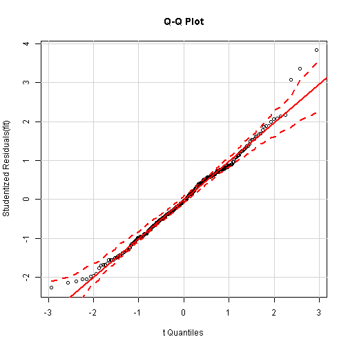
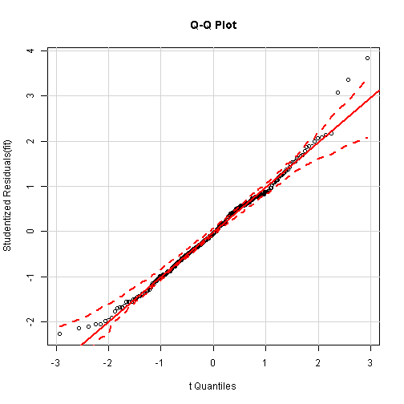

# Многофакторная линейная регрессионная модель зависимости продаж мороженного от погоды


## Аннотация 
В отчете исследована зависимость продаж мороженного (т.н. "импульсного" в упаковках до 200г) 
от метеорологических факторов - температуры, влажности, давления, ветра.
В целом можно сказать, что погода значительно влияет на продажи, при этом летом
это влияние не так заметно, гораздо заметнее связь в межсезонье, зимой связь 
совсем слабая. Также хочется отметить, что основным фактором с подавляющим 
перевесом является температура воздуха, остальные факторы влияют гораздо 
менее значимо, но усложняют модель.

тут таблица с результатами по сезонам.

## Подготовка данных
включаем нужные библиотеки

```r
library("dplyr")
library("ggplot2")
library("lattice")
library("xtable")
library("car")
```

Загрузка обработанных данных

```r
retail <- dget(file = "./retailtidy")
weather <- dget(file = "./weathertidy")
```

Объединение данных о продажах и погоде

```r
retweat <- merge(x=retail, y=weather, by = "date", all.x = T, all.y = F)
```

Выборка данных для бренда ТОП

```r
retweattop <- retweat[retweat$BRAND=="ТОП",]
```
в дальнейшем работаем с датасетом `retweattop`

## Разведочный анализ
предварительный анализ показал, что характер зависимости продаж от погоды 
значительно различается для различных времен года. смотрите для примера характер
зависимости продаж от температуры воздуха (обратите внимание на различие шкал)


```r
xyplot(saleskg~tem|season, data = retweattop, layout = c(1, 4), scales 
            = "free", breaks = 50)
```

 

поэтому было принято решение строить отдельные модели для различных времен года
для каждого из брендов (Топ, Юкки и Soletto)

## 1. Бренд: ТОП, сезон: ЛЕТО


```r
tmpseasonstr <- "summer"
tmpseason <- retweattop[retweattop$season==tmpseasonstr,]
```

### Подбор модели
Используем функцию `step` для автоподбора (берем только числовые переменные)

```r
model_full <- lm(saleskg ~ I(tem^2)+tem*clowdly*winds*humidity*ppp,
                 data = tmpseason[,c("saleskg", "tem", "clowdly", "winds", "humidity", "ppp")]) 
model_null <- lm(saleskg ~ 1, data = tmpseason[,c("saleskg", "tem", "clowdly", "winds", "humidity", "ppp")])
ideal_model <- step(object = model_full, scope = list(lower = model_null, upper = model_full), direction = 'backward')
```

Результат для наилучшей модели `ideal-model`

```
## Residual standard error: 224.2 on 261 degrees of freedom
## Multiple R-squared:   0.4055 Adjusted R-squared:   0.3736
## F-statistic:  12.72 on 14 and 261 DF,  p-value: < 2.22e-16
```
<!-- html table generated in R 3.2.2 by xtable 1.8-0 package -->
<!-- Mon Nov 23 13:58:09 2015 -->
<table border=1>
<tr> <th>  </th> <th> Estimate </th> <th> Std. Error </th> <th> t value </th> <th> Pr(&gt;|t|) </th>  </tr>
  <tr> <td align="right"> (Intercept) </td> <td align="right"> -289913.0004 </td> <td align="right"> 73269.3595 </td> <td align="right"> -3.96 </td> <td align="right"> 0.0001 </td> </tr>
  <tr> <td align="right"> I(tem^2) </td> <td align="right"> 3.2804 </td> <td align="right"> 1.1098 </td> <td align="right"> 2.96 </td> <td align="right"> 0.0034 </td> </tr>
  <tr> <td align="right"> tem </td> <td align="right"> 15284.0369 </td> <td align="right"> 3442.0792 </td> <td align="right"> 4.44 </td> <td align="right"> 0.0000 </td> </tr>
  <tr> <td align="right"> clowdly </td> <td align="right"> -69.7680 </td> <td align="right"> 33.5340 </td> <td align="right"> -2.08 </td> <td align="right"> 0.0385 </td> </tr>
  <tr> <td align="right"> winds </td> <td align="right"> 74446.7341 </td> <td align="right"> 28808.9290 </td> <td align="right"> 2.58 </td> <td align="right"> 0.0103 </td> </tr>
  <tr> <td align="right"> humidity </td> <td align="right"> 3103.4262 </td> <td align="right"> 1018.9854 </td> <td align="right"> 3.05 </td> <td align="right"> 0.0026 </td> </tr>
  <tr> <td align="right"> ppp </td> <td align="right"> 288.7620 </td> <td align="right"> 72.4160 </td> <td align="right"> 3.99 </td> <td align="right"> 0.0001 </td> </tr>
  <tr> <td align="right"> tem:winds </td> <td align="right"> -3670.2337 </td> <td align="right"> 1351.4018 </td> <td align="right"> -2.72 </td> <td align="right"> 0.0071 </td> </tr>
  <tr> <td align="right"> tem:humidity </td> <td align="right"> -177.9380 </td> <td align="right"> 51.8440 </td> <td align="right"> -3.43 </td> <td align="right"> 0.0007 </td> </tr>
  <tr> <td align="right"> clowdly:humidity </td> <td align="right"> 1.2554 </td> <td align="right"> 0.6838 </td> <td align="right"> 1.84 </td> <td align="right"> 0.0675 </td> </tr>
  <tr> <td align="right"> tem:ppp </td> <td align="right"> -15.2381 </td> <td align="right"> 3.4035 </td> <td align="right"> -4.48 </td> <td align="right"> 0.0000 </td> </tr>
  <tr> <td align="right"> winds:ppp </td> <td align="right"> -73.5951 </td> <td align="right"> 28.4548 </td> <td align="right"> -2.59 </td> <td align="right"> 0.0102 </td> </tr>
  <tr> <td align="right"> humidity:ppp </td> <td align="right"> -3.0906 </td> <td align="right"> 1.0072 </td> <td align="right"> -3.07 </td> <td align="right"> 0.0024 </td> </tr>
  <tr> <td align="right"> tem:winds:ppp </td> <td align="right"> 3.6262 </td> <td align="right"> 1.3339 </td> <td align="right"> 2.72 </td> <td align="right"> 0.0070 </td> </tr>
  <tr> <td align="right"> tem:humidity:ppp </td> <td align="right"> 0.1767 </td> <td align="right"> 0.0512 </td> <td align="right"> 3.45 </td> <td align="right"> 0.0007 </td> </tr>
   </table>
             

##  
Мы видим значимые различия найденной модели `ideal_model` по сравнению с 
моделью с максимальным количеством факторов `model_full` 

```r
xt <- anova(model_full, ideal_model)
```

<!-- html table generated in R 3.2.2 by xtable 1.8-0 package -->
<!-- Mon Nov 23 13:58:09 2015 -->
<table border=1>
<tr> <th>  </th> <th> Res.Df </th> <th> RSS </th> <th> Df </th> <th> Sum of Sq </th> <th> F </th> <th> Pr(&gt;F) </th>  </tr>
  <tr> <td> 1 </td> <td align="right"> 243 </td> <td align="right"> 12712025.38 </td> <td align="right">  </td> <td align="right">  </td> <td align="right">  </td> <td align="right">  </td> </tr>
  <tr> <td> 2 </td> <td align="right"> 261 </td> <td align="right"> 13124748.54 </td> <td align="right"> -18 </td> <td align="right"> -412723.16 </td> <td align="right"> 0.44 </td> <td align="right"> 0.9784 </td> </tr>
   </table>

##
Но ручной подбор позволяет упростить модель, сохранив при этом значение коэффициента 
детерминации `Adjusted R-squared` и значимость коэффициентов

```r
fit <- lm(saleskg^(1/3) ~ I(tem^2)+tem*humidity*ppp, data = tmpseason) 
```

```
## Residual standard error: 1.068 on 267 degrees of freedom
## Multiple R-squared:   0.3855 Adjusted R-squared:   0.3671
## F-statistic:  20.94 on 8 and 267 DF,  p-value: < 2.22e-16
```
<!-- html table generated in R 3.2.2 by xtable 1.8-0 package -->
<!-- Mon Nov 23 13:58:09 2015 -->
<table border=1>
<tr> <th>  </th> <th> Estimate </th> <th> Std. Error </th> <th> t value </th> <th> Pr(&gt;|t|) </th>  </tr>
  <tr> <td align="right"> (Intercept) </td> <td align="right"> -705.0332 </td> <td align="right"> 281.9774 </td> <td align="right"> -2.50 </td> <td align="right"> 0.0130 </td> </tr>
  <tr> <td align="right"> I(tem^2) </td> <td align="right"> 0.0102 </td> <td align="right"> 0.0052 </td> <td align="right"> 1.96 </td> <td align="right"> 0.0506 </td> </tr>
  <tr> <td align="right"> tem </td> <td align="right"> 36.5901 </td> <td align="right"> 12.9073 </td> <td align="right"> 2.83 </td> <td align="right"> 0.0049 </td> </tr>
  <tr> <td align="right"> humidity </td> <td align="right"> 12.3805 </td> <td align="right"> 4.7400 </td> <td align="right"> 2.61 </td> <td align="right"> 0.0095 </td> </tr>
  <tr> <td align="right"> ppp </td> <td align="right"> 0.7064 </td> <td align="right"> 0.2786 </td> <td align="right"> 2.54 </td> <td align="right"> 0.0118 </td> </tr>
  <tr> <td align="right"> tem:humidity </td> <td align="right"> -0.6822 </td> <td align="right"> 0.2339 </td> <td align="right"> -2.92 </td> <td align="right"> 0.0038 </td> </tr>
  <tr> <td align="right"> tem:ppp </td> <td align="right"> -0.0365 </td> <td align="right"> 0.0128 </td> <td align="right"> -2.86 </td> <td align="right"> 0.0046 </td> </tr>
  <tr> <td align="right"> humidity:ppp </td> <td align="right"> -0.0123 </td> <td align="right"> 0.0047 </td> <td align="right"> -2.62 </td> <td align="right"> 0.0092 </td> </tr>
  <tr> <td align="right"> tem:humidity:ppp </td> <td align="right"> 0.0007 </td> <td align="right"> 0.0002 </td> <td align="right"> 2.93 </td> <td align="right"> 0.0037 </td> </tr>
   </table>

### Проверка модели

1.1 нормальность остатков (тест Шапиро-Вилка)

```r
test1 <- shapiro.test(fit$residuals)
```

```r
cat(ifelse(test1$p.value < 0.05, "Остатки не распределены нормально", "Остатки распределены нормально"), ", p-значение: ", test1$p.value)
```

```
## Остатки не распределены нормально , p-значение:  0.04719421
```

1.2 визуальная оценка нормальности остатков (QQ-plot)

```r
qqPlot(fit, labels=row.names(tmpseason), id.method="identify",
       simulate=TRUE, main="Q-Q Plot")
```

 

2. независимость остатков (тест Дарбина-Уотсона)

```r
test2 <- durbinWatsonTest(fit)
```

```r
cat(ifelse(test2$p < 0.05, "Есть зависимость", "Нет зависимости"), ", p-значение: ", test2$p)
```

```
## Есть зависимость , p-значение:  0.04
```

3.1 гомоскедастичность остатков

```r
test3 <- ncvTest(fit) 
```

```r
cat(ifelse(test3$p < 0.05, "Гомоскедастичность НЕ выполняется", "Гомоскедастичность выполняется"), ", p-значение: ", test3$p)
```

```
## Гомоскедастичность выполняется , p-значение:  0.1789209
```

3.2 Визуальная оценка гомоскедастичности

```r
spreadLevelPlot(fit)
```

 

##  
**Вывод:** можно сказать что модель соответствует требованиям, те небольшие 
отклонения от нормальности можно нивелировать при подгонке модели.


### Подгонка модели
Этап подгонки подели подробно не расписывал. Если кратко выбросы находил с помощью
теста Бонферони, расчета метрики Кука для поиска влиятельных значений, а также 
визуально на графиках, но как правило удалял немного - около 4-7 наблюдений.


## Визуализация результатов
Кривая зависимости продаж от температуры при различных комбинациях давления и влажности


 

##  
**Вывод:** На данном графике хочется отметить (см. верхний), что при повышенном 
давлении продажи выше, если влажность выше.
В целом, попытка посмотреть на найденную зависимость при различных срезах 
предикторов наводит на мысль, что переменные Влажность и Давление не так явно 
влияют на продажи, но при этом значительно усложняют модель и ее интерпретацию.


Далее, рассмотрим еще модель для бренда ТОП для весны, будем смотреть зависимость
только от температуры.

## 1. Бренд: ТОП, сезон: ВЕСНА


```r
tmpseasonstr <- "spring"
tmpseason <- retweattop[retweattop$season==tmpseasonstr,]
```

## Подбор модели
Здесь подбирал коэффициенты вручную

```r
fit <- lm(saleskg^(1/3) ~ tem+I(tem^2), data = tmpseason) 
```

```
## Residual standard error: 0.9642 on 273 degrees of freedom
## Multiple R-squared:   0.6638 Adjusted R-squared:   0.6613
## F-statistic:  269.52 on 2 and 273 DF,  p-value: < 2.22e-16
```
<!-- html table generated in R 3.2.2 by xtable 1.8-0 package -->
<!-- Mon Nov 23 13:58:10 2015 -->
<table border=1>
<tr> <th>  </th> <th> Estimate </th> <th> Std. Error </th> <th> t value </th> <th> Pr(&gt;|t|) </th>  </tr>
  <tr> <td align="right"> (Intercept) </td> <td align="right"> 4.3871 </td> <td align="right"> 0.0971 </td> <td align="right"> 45.19 </td> <td align="right"> 0.0000 </td> </tr>
  <tr> <td align="right"> tem </td> <td align="right"> 0.0971 </td> <td align="right"> 0.0168 </td> <td align="right"> 5.77 </td> <td align="right"> 0.0000 </td> </tr>
  <tr> <td align="right"> I(tem^2) </td> <td align="right"> 0.0035 </td> <td align="right"> 0.0008 </td> <td align="right"> 4.49 </td> <td align="right"> 0.0000 </td> </tr>
   </table>

##
как видим модель гораздо более полно описывает продажи, чем предыдущая, доля 
объясненной дисперсии в весенней модели гораздо выше - 0.66 против 0.37 летом. 
Но это особенность сезона - по всем брендам летом влияние погоды (а точнее я 
смотрел температуру) не так значительно как весной или осенью. Зимой метео 
условия вообще мало влияют на продажи.

## Проверка модели

1.1 нормальность остатков (тест Шапиро-Вилка)

```r
test1 <- shapiro.test(fit$residuals)
```

```
## Остатки не распределены нормально , p-значение:  6.171487e-05
```

1.2 визуальная оценка нормальности остатков (QQ-plot)
 

2. независимость остатков (тест Дарбина-Уотсона)

```r
test2 <- durbinWatsonTest(fit)
```

```
## Есть зависимость , p-значение:  0.004
```

3.1 гомоскедастичность остатков

```r
test3 <- ncvTest(fit) 
```

```
## Гомоскедастичность НЕ выполняется , p-значение:  4.80107e-08
```

3.2 Визуальная оценка гомоскедастичности

```r
spreadLevelPlot(fit)
```

 

## 
**Вывод:** есть значительные отклонения от требования, подгонка модели не помогла
полностью привести модель в соответствие с требованиями.


## Подгонка модели
Этап подгонки подели подробно не расписывал.

## Визуализация результатов
Кривая зависимости продаж от температуры


```r
ggplot(data = tmpseason, aes(x=tem, y=saleskg))  + geom_point(col="grey", size=4,  alpha = 1/2) + 
  geom_line(aes(x = tem, y = (fit$fitted.values)^3), col = 'blue', lwd=1)+
  geom_line(aes(x = tem, y = (fit$fitted.values)^3+1.6*sd((fit$residuals)^3)), col = 'red',  linetype = 3)+
  geom_line(aes(x = tem, y = (fit$fitted.values)^3-1.6*sd((fit$residuals)^3)), col = 'red',  linetype = 3)
```

 

## Общий вывод
В целом можно сказать, что погода значительно влияет на продажи, при этом летом
это влияние не так заметно, гораздо заметнее связь в межсезонье, зимой связь 
совсем слабая. Также хочется отметить, что основным фактором с подавляющим 
перевесом является температура воздуха, остальные факторы влияют гораздо 
менее значимо, но усложняют модель.


```
## 
## 
## processing file: Analys_Sales_Weather_TOP.Rmd
```

```
## Error in parse_block(g[-1], g[1], params.src): duplicate label 'topspring'
```


